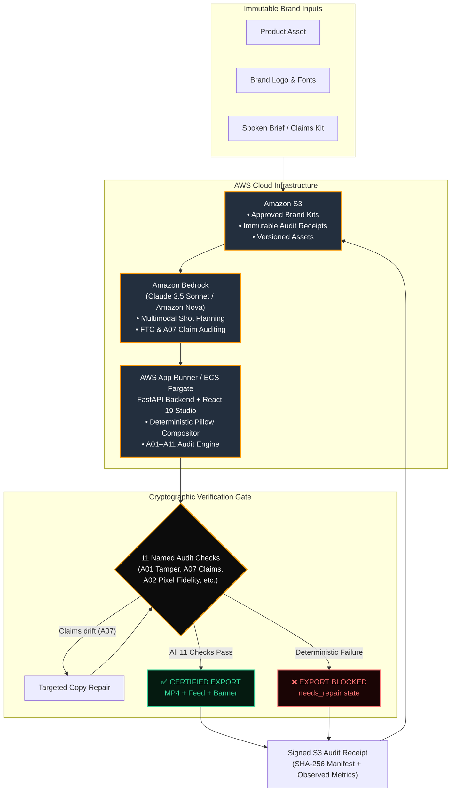

# Rivet

<div align="center">


### **A Compliance-First, Verification-Based AI Advertising Platform on AWS**

[](https://wemakedevs.org)
[](#)
[-blue)](#team)
[](LICENSE)
[](deploy/cloudformation.yaml)
[](#verification)

> ### **"Rivet generates AI ads, but only lets them ship when the product assets, claims, and brand rules are verified—and it gives you proof of what passed."**

[**Live Web Studio ↗**](#quickstart) · [**AWS Architecture ↗**](#aws-architecture) · [**The 11 Audit Checks ↗**](#the-audit--eleven-checks-every-scene) · [**Deploy to AWS ↗**](#deploy-on-aws-ship-it-track)

</div>

---

## Target Users: E-Commerce Sellers & Amazon Advertisers

- **Amazon Sellers & E-Commerce Merchants**: Sellers running Sponsored Brands and Sponsored Video campaigns who cannot afford ad campaign rejections, trademark drift, or FTC claim flags.
- **Agile D2C Teams**: Businesses without dedicated legal or brand-compliance departments who need generative ad creation speed without risking brand damage or account penalties.
- **Scope of Verification**: Rivet provides **algorithmic pre-flight policy gating and cryptographic evidence**. It does not replace corporate legal counsel; rather, it mathematically proves that rendered assets match approved source files, copy conforms to brand rules, and safe-zones are respected before any media is exported.

---

## The Problem: Generative AI Ads are Fast, but Dangerous

Generative AI made advertising creation instantaneous, but it didn't make it **safe**:

1. **Hallucinated Claims & Marketplace Flags**: A model reaches for persuasive copy and claims a cosmetic is "clinically proven" or a speaker is "100% waterproof" when neither is approved.
2. **Brand & Asset Drift**: Generative models redraw whatever they are given — bending logos, distorting typography, and changing product packaging colors.
3. **Strict Marketplace Gating (Amazon Ads, Meta, Google)**: When an ad is flagged by Amazon Ads or regulators, campaigns are terminated and accounts risk suspension.

> **Most generative ad tools ask you to trust the model. Rivet doesn't.**  
> In Rivet, **a failing ad cannot exist**. If an audit check fails, export is hard-blocked and a signed compliance receipt documents the exact failure reason.

---

## AWS Architecture

Rivet is architected as an **AWS Cloud-Native** platform engineered for high-throughput, enterprise-grade e-commerce advertising:



### AWS Services Utilized

| AWS Service | Role in Rivet |
| :--- | :--- |
| **Amazon Bedrock** | Powers multimodal scene planning (hook, proof, CTA) and semantic compliance audits (`A07` forbidden claims & FTC checks) using Claude 3.5 Sonnet and Amazon Nova. |
| **Amazon S3** | Serves as an **immutable compliance ledger**. Stores brand-approved assets and cryptographically signed `receipt.json` files with SHA-256 object tagging and versioning. |
| **AWS App Runner / ECS** | Hosts the containerized FastAPI verification engine and React 19 web studio with automated auto-scaling and zero server maintenance. |
| **Amazon CloudFront** | Low-latency global edge delivery of rendered multi-format video ads and banner assets. |
| **AWS IAM** | Least-privilege role separation ensuring secure Bedrock inference and S3 receipt writes. |

---

## The Audit — Eleven Checks, Every Scene

Rivet executes deterministic checks plus semantic verification on every scene across 3 formats (9:16 vertical video, 1:1 square feed, 16:9 landscape banner) — up to **90 checks per campaign**.

| Check | Name | What it Verifies | Enforcement |
| :---: | :--- | :--- | :---: |
| **A01** | **Lineage & Tamper** | Confirms product and logo match approved source assets by exact SHA-256 | **HARD BLOCK** |
| **A02** | **Logo Fidelity** | Validates logo in final frame matches source logo pixel-for-pixel | **HARD BLOCK** |
| **A03** | **Copy Integrity** | Rendered typography matches approved brand copy character-for-character | **HARD BLOCK** |
| **A04** | **Palette Drift** | Verifies backgrounds adhere to brand color harmonies (max ΔE tolerance) | **HARD BLOCK** |
| **A05** | **Safe Area** | Guarantees zero text overflow and adherence to platform safe-zones | **HARD BLOCK** |
| **A06** | **Product Share** | Ensures product prominence occupies at least required frame percentage | **HARD BLOCK** |
| **A07** | **Forbidden Claims** | Catches unapproved superlatives (e.g. "Best in the world", "FDA Approved") | **AUTO-REPAIR / BLOCK** |
| **A08** | **Semantic Alignment** | Advisory visual-semantic fit evaluated via Amazon Bedrock | *Advisory* |
| **A09** | **Cutout Accuracy** | Product cutout matches source mask with zero edge distortion | **HARD BLOCK** |
| **A10** | **Text Contrast** | Enforces WCAG 4.5:1 minimum legibility against dynamic backgrounds | **HARD BLOCK** |
| **A11** | **Font Coverage** | Verifies every character exists in the packaged font (zero tofu blocks) | **HARD BLOCK** |

---

## Multi-Format Export Pack

When a campaign passes all checks, Rivet produces a complete advertising package:
1. **Vertical Story Video (1080×1920)** — 3-scene synchronized motion video with synthesized narration (Kokoro) and SRT captions.
2. **Square Feed Asset (1080×1080)** — Optimized for Amazon Sponsored Brands and Instagram feed.
3. **Banner Asset (1920×1080)** — High-impact display placement.
4. **`receipt.json`** — Cryptographically signed audit record specifying exact observed values, thresholds, seeds, and hashes.
5. **`manifest.json`** — SHA-256 digest of every file in the export pack.

---

## Quickstart

### Option 1: Docker (Fastest & Unified)

Run the entire fullstack platform (FastAPI backend + React 19 Studio) in one command:

```bash
# Clone the repository
git clone https://github.com/arjitujjawal-art/Rivet.git
cd Rivet

# Run with Docker Compose
docker compose up --build
```
Open **[http://localhost:8000](http://localhost:8000)** in your browser to access the live Studio!

---

### Option 2: Local Development

#### 1. Frontend Web Studio
```bash
cd apps/web
npm install
npm run dev
# Running on http://localhost:5173
```

#### 2. Backend Engine
```bash
# Python 3.11+
py -3.11 -m pip install -e .
py -3.11 -m uvicorn services.api.main:app --reload --port 8000
```

---

## Deploy on AWS ("Ship It" Track)

### 1. Automated CloudFormation Deployment
Deploy the complete AWS infrastructure (S3 Audit Ledger + IAM Roles) in seconds:

```bash
chmod +x deploy/aws-deploy.sh
./deploy/aws-deploy.sh
```

### 2. Deploy to AWS App Runner / Amazon ECR
```bash
# 1. Retrieve Account & Region automatically
ACCOUNT_ID=$(aws sts get-caller-identity --query Account --output text)
REGION=${AWS_REGION:-us-east-1}

# 2. Authenticate Docker with Amazon ECR
aws ecr create-repository --repository-name rivet --region $REGION || true
aws ecr get-login-password --region $REGION | docker login --username AWS --password-stdin $ACCOUNT_ID.dkr.ecr.$REGION.amazonaws.com

# 3. Tag & Push Production Container
docker tag rivet:latest $ACCOUNT_ID.dkr.ecr.$REGION.amazonaws.com/rivet:latest
docker push $ACCOUNT_ID.dkr.ecr.$REGION.amazonaws.com/rivet:latest
```
Create an AWS App Runner service pointing to your ECR image. App Runner will automatically deploy and provide an HTTPS production URL.

---

## Verification & Honesty

Rivet includes an automated diagnostic suite to verify environment health and deterministic audit guarantees:

```bash
# 1. Verify AWS connection and system dependencies
curl http://localhost:8000/api/aws/status

# 2. Run deterministic check unit tests
pytest -q tests/unit/test_audit_checks.py tests/unit/test_receipt.py tests/unit/test_aws_adapters.py
```

---

## Team

Built with ❤️ by **Team choco** (Team Code: `PYY34M`) for **First Commit — WeMakeDevs x AWS Hackathon 2026** (*Ship It* track):

- **Ganesh Nair** — Team Lead
- **Arjit Ujjawal**

---

## License

This project is licensed under the [MIT License](LICENSE).
